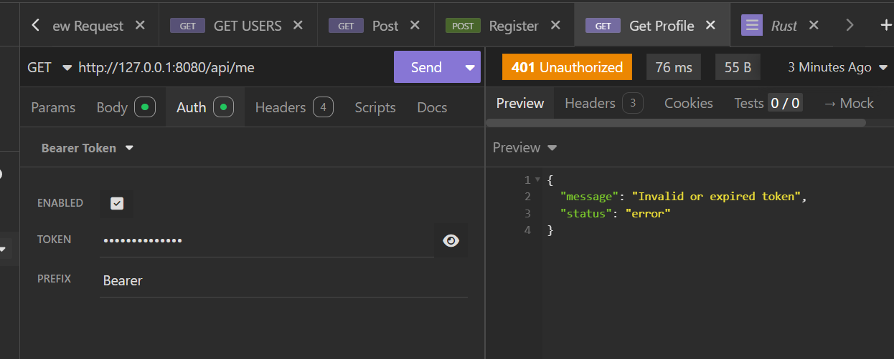

no middleware/auth
faltava 
req.app_data::<web::Data<AppState>>() e o importe

use actix_web::web;

vams testar no insomnia

2 - vamos em controllers/me.rs para pegar o id do user

use actix_web::{ get, post, Responder};
use actix_web::HttpRequest;
use actix_web::HttpMessage;
#[get("/me")]
pub async fn get_profile(req: HttpRequest) -> impl Responder {
    let ext = req.extensions();
    let user_id = ext.get::<u64>().unwrap();

    format!("User {}", user_id)
    
}

